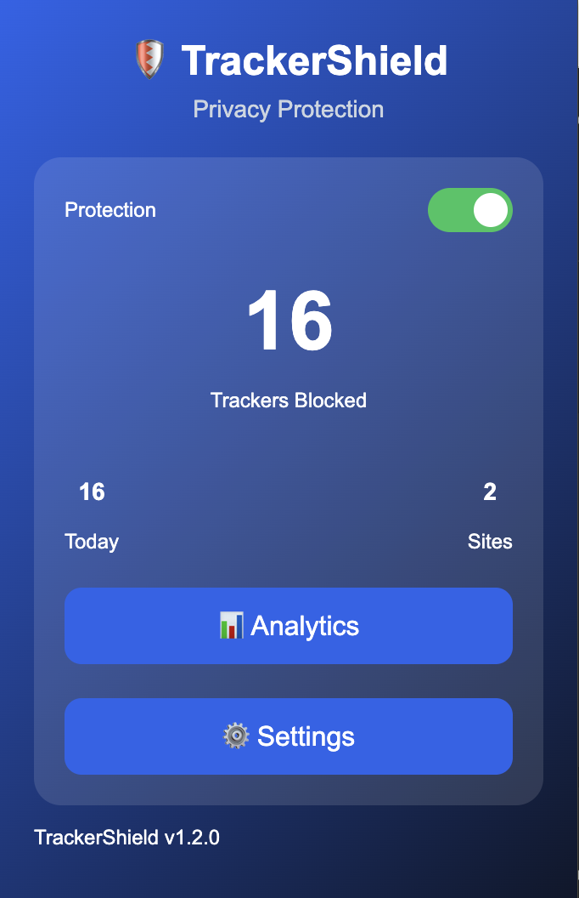
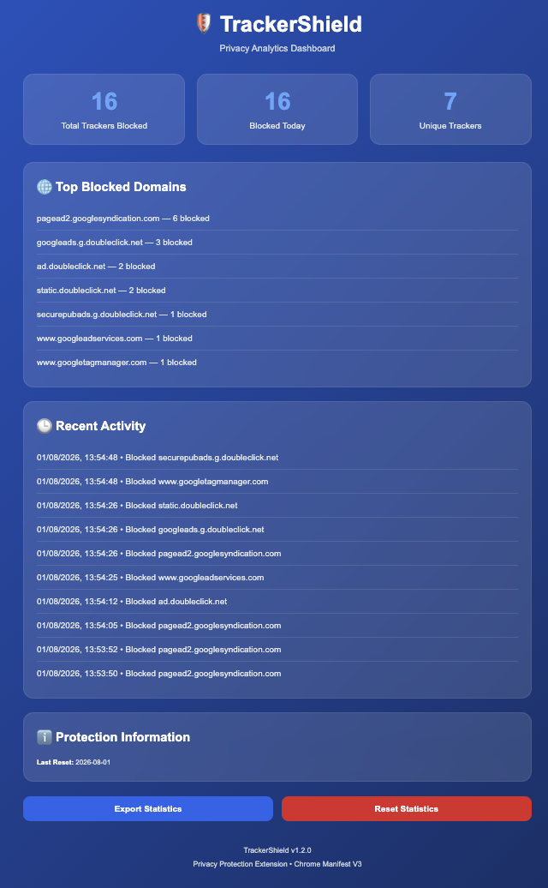
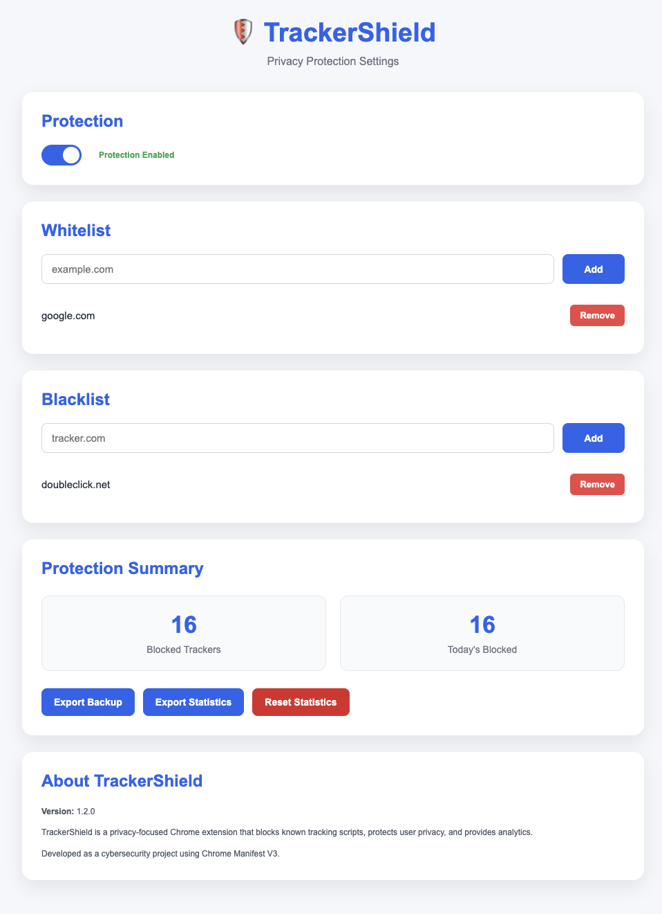

# 🛡️ TrackerShield


A privacy-focused Chrome Extension built using Chrome Manifest V3 that blocks known tracking scripts, protects user privacy, and provides real-time analytics of blocked trackers.

---

# 📖 Table of Contents

- Features
- Technologies Used
- Project Structure
- Screenshots
- Installation
- How It Works
- Future Improvements
- Author
- License

---

# ✨ Features

- 🛡️ Tracker protection toggle
- 🚫 Blocks known tracking domains
- 📊 Analytics dashboard
- ⚙️ Settings page
- 📈 Real-time statistics
- 💾 Local Chrome Storage
- 🌐 Site activity tracking
- 🔄 Reset statistics option
- ⚡ Chrome Manifest V3 compliant

---

# 🛠 Technologies Used

- HTML5
- CSS3
- JavaScript (ES6)
- Chrome Extension API
- Chrome Storage API
- Declarative Net Request API
- Manifest V3

---

# 📂 Project Structure

```
TrackerShield/
│
├── icons/
├── analytics.html
├── analytics.css
├── analytics.js
├── options.html
├── options.css
├── options.js
├── popup.html
├── popup.css
├── popup.js
├── background.js
├── statistics.js
├── rules.json
├── trackers.txt
├── manifest.json
├── README.md
├── LICENSE
├── CHANGELOG.md
├── CONTRIBUTING.md
├── CODE_OF_CONDUCT.md
└── SECURITY.md
```

---

# 📸 Screenshots

## 🛡️ Extension Popup



---

## 📊 Analytics Dashboard



---

## ⚙️ Settings Page



---

# 🚀 Installation

1. Download or clone this repository.

```
git clone https://github.com/Ejojaneesh/Trackershield.git
```

2. Open Google Chrome.

3. Navigate to:

```
chrome://extensions/
```

4. Enable **Developer Mode**.

5. Click **Load Unpacked**.

6. Select the TrackerShield project folder.

7. The extension is now installed and ready to use.

---

# ⚙️ How It Works

TrackerShield uses Chrome's Declarative Net Request API to block requests made to known tracking domains.

The extension:

- Detects supported tracking requests
- Blocks tracker domains
- Records blocking statistics
- Tracks visited websites
- Stores data locally using Chrome Storage API
- Displays analytics through an interactive dashboard
- Allows users to enable or disable protection
- Provides a settings page to reset stored statistics

---

# 📈 Future Improvements

- Dark mode
- Custom block lists
- Tracker categorization
- Weekly and monthly analytics
- Export statistics
- Sync settings across Chrome devices
- Real-time notifications
- Whitelist support

---

# 👨‍💻 Author

**Ejo Janeesh**

GitHub:
https://github.com/Ejojaneesh

---

# 📄 License

This project is licensed under the MIT License.

See the LICENSE file for more details.

---

⭐ If you found this project useful, consider giving it a star on GitHub.